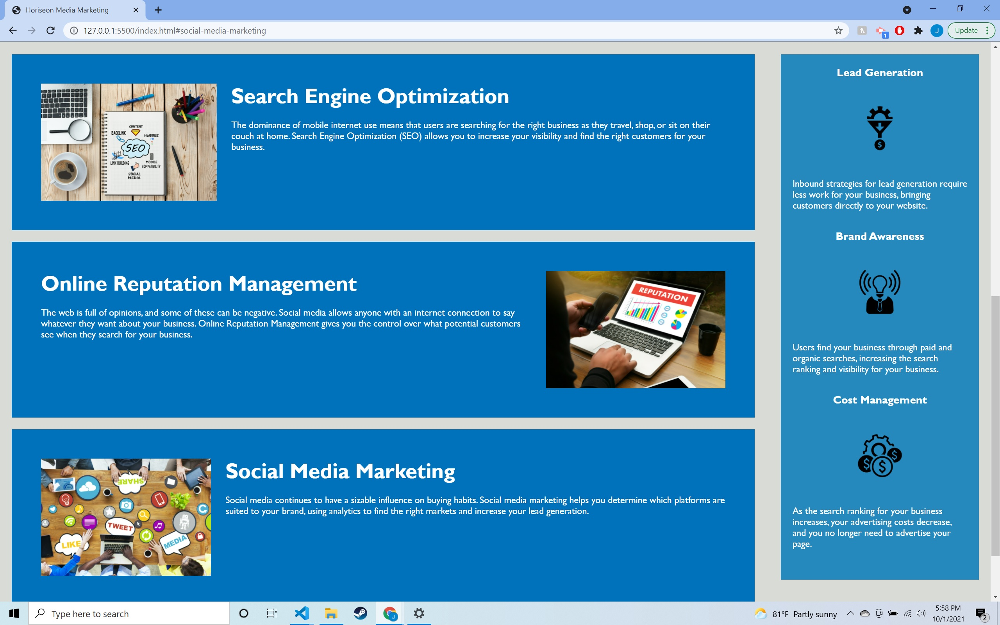
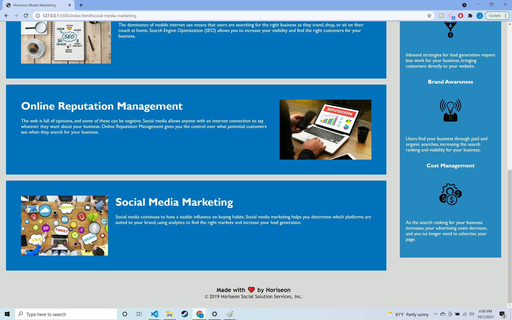
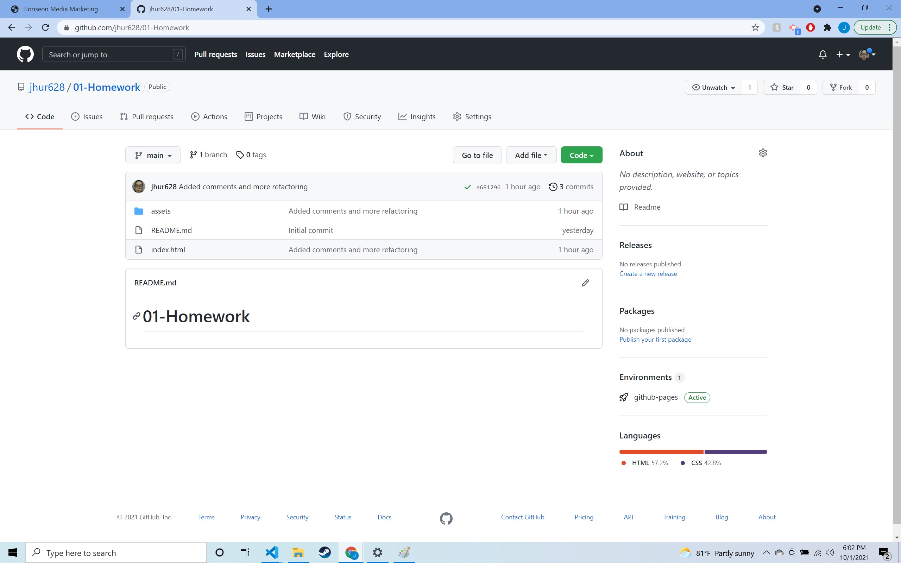

# 01-Homework HTML, CSS, and Git: Refactor

## Description

Repository 01-Homework was created and cloned to my bootcamp/homework folder using "git clone" command.

Copied homework folders and files from NU-CHI repository into 01-Homework.

Refactored HTML and CSS files, ensuring accessability and semantic HTML elements.

Pushed repository to github to ensure application was functioning correctly, utilizing commands: "git status", "git add", "git commit", and "git push".

Completed this README file and double-checked code.

Pushed repository for final product.

## Screenshots

## Links

[Github Website](https://jhur628.github.io/01-Homework/)

[Repository](https://github.com/jhur628/01-Homework)

## Special Thanks

The study group on 9/30/2021 was very helpful. If I did a good job, a lot of credit should be given to the people in the study group. A big shoutout to them!